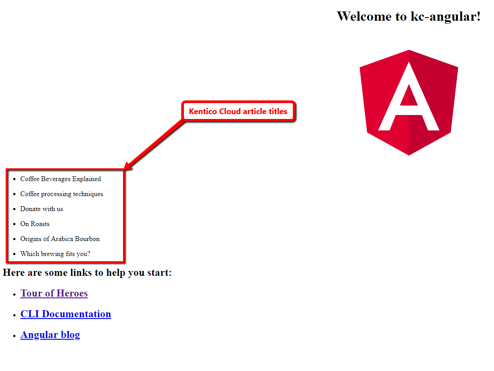

# Kentico Cloud :heart: Angular

This project was generated with [Angular CLI](https://github.com/angular/angular-cli) version 7.3.8.

## How to achieve this state

1. Install the [Angular cli](https://cli.angular.io) and generate the bootstrapped application (no Router was included)

    In the target folder

    ```sh
    npm install -g @angular/cli
    ng new kc-angular # say no for router option
    cd kc-angular
    ng serve # in case of testing
    ```

1. Install Kentico Cloud JavaScript SDK

    ```sh
    npm install --save rxjs kentico-cloud-delivery
    ```

1. Extend [App component code](src/app/app.component.ts) (final state)

    1. Add required imports

        ```typescript
        import { Component, OnInit } from '@angular/core';
        import {
          DeliveryClient,
          IDeliveryClient
          ContentItem
          } from 'kentico-cloud-delivery';
        ```

    1. Introduce required properties and set them in constructor

        ```typescript
        client: IDeliveryClient;
        articles: ContentItem[];
        loaded: boolean;
        title = 'kc-angular';

        constructor() {
          this.client = new DeliveryClient({
            projectId: '975bf280-fd91-488c-994c-2f04416e5ee3' 
            });
          this.loaded = false;
          this.articles = [];
        }
        ```

    1. Load data from Kentico Cloud and pass them to the `articles` property on `ngOnInit` method.

        ```typescript
        ngOnInit(): void {
            this.client.items()
              .type('article')
              .getPromise()
              .then(result => {
                console.log(result.items);
                this.articles = result.items;
                this.loaded = true;
              });
          }
        ```

    1. Adjust [App component template](src/app/app.component.html) (final result)

        By adding html `section` tag

        ```html
        <section *ngIf="loaded">
          <ul *ngFor="let article of articles">
            <li>{{article.elements.title.value}}</li>
          </ul>
        </section>
        ```

1. Run the app

```sh
npm start
```

> **Hurray! Kentico Cloud :heart: Angular!**




---
---

## Application documentation

### Development server

Run `ng serve` for a dev server. Navigate to `http://localhost:4200/`. The app will automatically reload if you change any of the source files.

### Code scaffolding

Run `ng generate component component-name` to generate a new component. You can also use `ng generate directive|pipe|service|class|guard|interface|enum|module`.

### Build

Run `ng build` to build the project. The build artifacts will be stored in the `dist/` directory. Use the `--prod` flag for a production build.

### Running unit tests

Run `ng test` to execute the unit tests via [Karma](https://karma-runner.github.io).

### Running end-to-end tests

Run `ng e2e` to execute the end-to-end tests via [Protractor](http://www.protractortest.org/).

### Further help

To get more help on the Angular CLI use `ng help` or go check out the [Angular CLI README](https://github.com/angular/angular-cli/blob/master/README.md).
