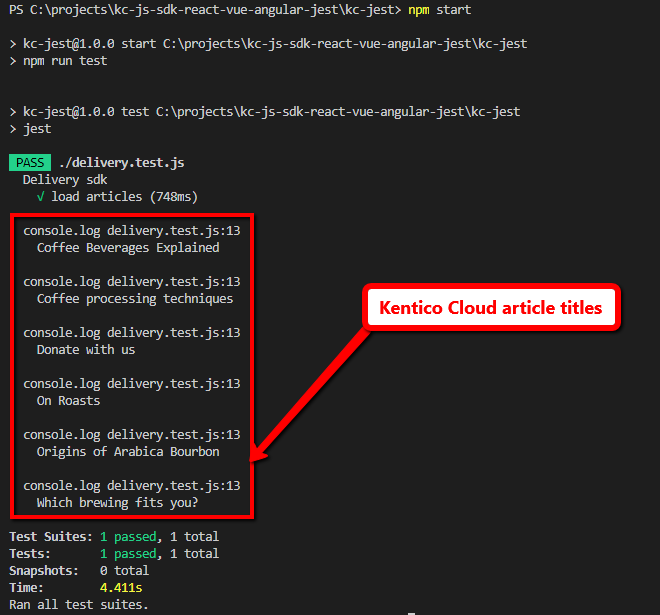

# Kentico Cloud :heart: Jest

This project was written from scratch using jus `npm init` command to showcase how to start with [jest](https://jestjs.io) testing framework in combination with [Kentico Cloud Delivery SDK](https://github.com/Kentico/kentico-cloud-js/tree/master/packages/delivery#kentico-cloud-delivery-sdk).

## How to achieve this state

1. Initialize the npm application

    1. Create a project folder

    ```sh
    mkdir kc-jest
    cd kc-jest
    ```

    1. Initialize the npm package

    ```sh
    npm init -y
    ```

    This will generate `package.json` file ([more info](https://docs.npmjs.com/cli/init)).

1. Add [`.gitignore`](.gitignore) file to avoid spamming repository by `node_modules` content

1. Install all required dependencies

    ```sh
    npm install --save-dev rxjs kentico-cloud-delivery jest
    ```

    * `rxjs` is a peer dependency for `kentico-cloud-delivery`
    * `jest` is a testing framework

    Development dependencies are listed in [`package.json`] an installed in `node_,modules` folder.

    ```plain
    {
      ...
      "devDependencies": {
        "jest": "^24.7.1",
        "kentico-cloud-delivery": "^5.7.2",
        "rxjs": "^6.4.0"
      }
      ...
    }
    ```

1. Write the (end-to-end) test ([delivery.test.js](delivery.test.js))

      ```javascript
      const { DeliveryClient } = require('kentico-cloud-delivery');

      describe('Delivery sdk', () => {
        it("load articles", async () => {
          const client = new DeliveryClient({
             projectId: "975bf280-fd91-488c-994c-2f04416e5ee3"
             });

          const result = await client.items()
            .type("article")
            .getPromise();

          expect(result).toHaveProperty('items');
          expect(result.items).toHaveLength(6);
          result.items.forEach(item => console.log(item.elements.title.value)); // Just to see the titles in log
          // expect(result).toMatchSnapshot(); // Just a snapshot sample (https://jestjs.io/docs/en/snapshot-testing)
        })
      })
      ```

1. Add test script to the [`package.json`](package.json),

      ```plain
      {
        ...
        "scripts": {
            "test": "jest"
        }
      }
      ```

1. Run the tests

```sh
npm run test
```

> **Hurray! Kentico Cloud :heart: Jest!**


