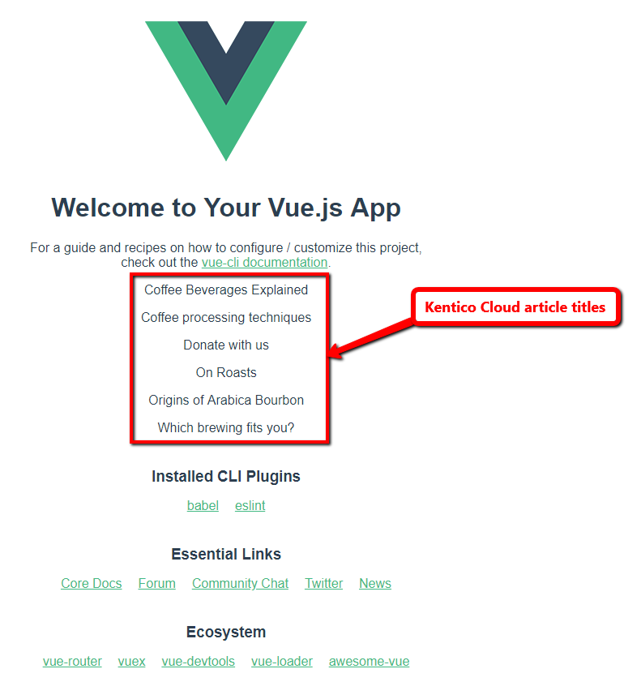

# Kentico Cloud :heart: Vue

This project was bootstrapped with [Vue CLI](https://cli.vuejs.org/) using VUE UI.

## How to achieve this state

1. Use [@vue/cli CLI](https://cli.vuejs.org/guide/installation.html) to create application skeleton

    In the target folder

    ```sh
    npm install -g @vue/cli
    vue create kc-vue # Use default setup
    cd  kc-vue # Use default setup
    ```

    or

    ```sh
    npm install -g @vue/cli
    vue ui # Use http://localhost:8000/project/ to create a new project using the UI
    cd kc-vue
    ```

1. Install Kentico Cloud JavaScript SDK

    ```sh
    npm install --save rxjs kentico-cloud-delivery
    ```

1. Extend [Hello world component](src/components/HelloWord.vue) (final state)

    1. Add required imports

        ```javascript
        import { DeliveryClient } from 'kentico-cloud-delivery';
        ```

    1. Initialize client

        ```javascript
        const client = new DeliveryClient({
           projectId: "975bf280-fd91-488c-994c-2f04416e5ee3"
        });
        ```

    1. Define [component initial data](https://vuejs.org/v2/api/#data) - [as a function](https://vuejs.org/v2/guide/components.html#data-Must-Be-a-Function)

        ```javascript
        data: function() {
          return {
            loaded: false,
            articles: []
          };
        },
        ```

    1. Load the data to the component state using the client in component [`mounted` hook](https://vuejs.org/v2/api/#mounted).

        ```javascript
        mounted: function(){
          client.items()
            .type("article")
            .getPromise()
            .then(result => {
              // eslint-disable-next-line no-console
              console.log(result.items);
              this.articles = result.items;
              this.loaded = true;
            });
        }
        ```

    1. Set the data to be rendered in the component [template section](https://vuejs.org/v2/api/#template) using [v-for](https://vuejs.org/v2/guide/list.html#v-for-on-a-lt-template-gt)

        ```html
        <section v-if="loaded">
          <ul v-for="article in articles" v-bind:key="article.system.id">
            <li>{{article.elements.title.value}}</li>
          </ul>
        </section
        ```

1. Run the app

```sh
npm run serve
```

> **Hurray! Kentico Cloud :heart: Vue!**



---
---

## Application documentation

### Project setup

```sh
npm install
```

#### Compiles and hot-reloads for development

```sh
npm run serve
```

#### Compiles and minifies for production

```sh
npm run build
```

#### Run your tests

```sh
npm run test
```

#### Lints and fixes files

```sh
npm run lint
```

#### Customize configuration

See [Configuration Reference](https://cli.vuejs.org/config/).
